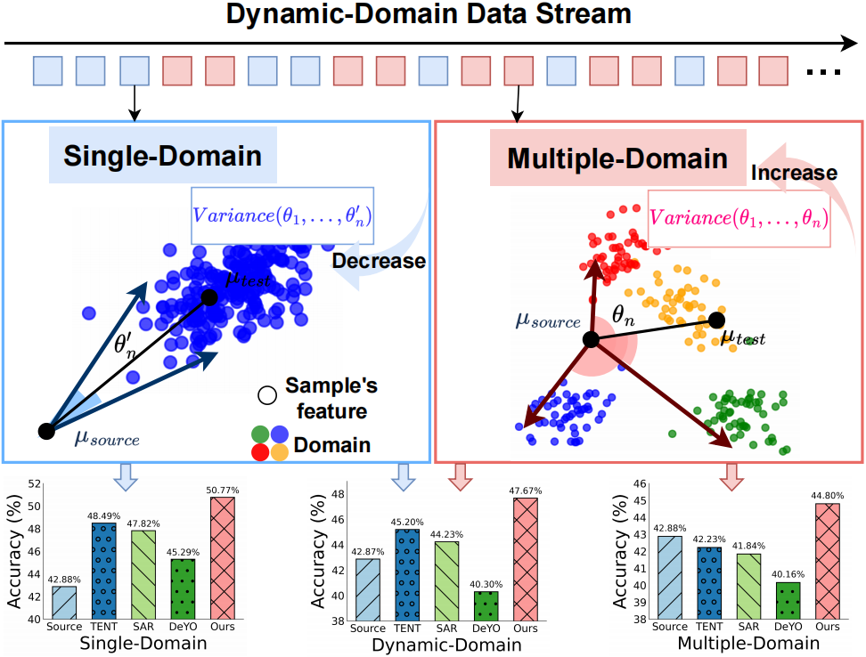
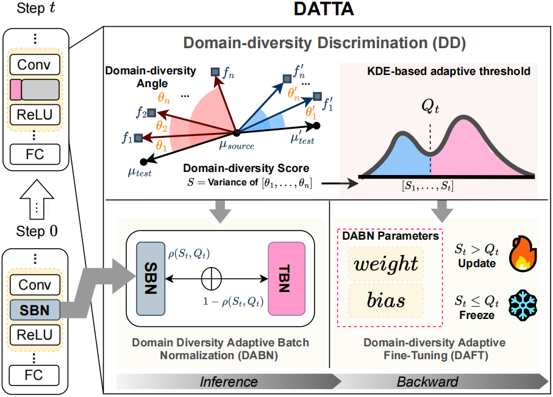

# DATTA: Domain Diversity Aware Test-Time Adaptation for Dynamic Domain Shift Stream

This repository is the official implementation of

**[DATTA: Domain Diversity Aware Test-Time Adaptation for Dynamic Domain Shift Stream](https://arxiv.org/abs/2408.08056), ICME, 2025**\
Chuyang Ye^†^, Dongyan Wei^†^, Zhendong Liu, Yuanyi Pang, Yixi Lin, Qinting Jiang, Jingyan Jiang*, Dongbiao He

It's based on the  **[TTAB repository](https://github.com/LINs-lab/ttab)**, which is offically implementation of the paper **[On Pitfalls of Test-time Adaptation](https://arxiv.org/abs/2306.03536)**.

    TL;DR: we propose Domain-Diversity Adaptive Test-Time Adaptation (DATTA), the first approach to handle TTA under dynamic domain shift streams. It is guided by a novel domain-diversity score. DATTA has three key components: a domain diversity discriminator to recognize single- and multi-domain patterns, domain-diversity adaptive batch normalization to combine source and test-time statistics, and domain-diversity adaptive fine-tuning to resolve gradient conflicts.

<table>
  <tr>
    <td></td>
    <td></td>
  </tr>
</table>

### Requirements
```
conda env create -f environment.yml
```
The TTAB package depends on the following requirements:
- finch-clust>=0.2.0
- numpy>=1.21.5
- pandas>=1.1.5
- pillow>=9.0.1
- pytz>=2021.3
- torch>=1.7.1
- torchvision>=0.8.2
- timm>=0.6.11
- scikit-learn>=1.0.3
- scipy>=1.7.3
- tqdm>=4.56.2
- tyro>=0.5.5

### Model
Our implementations use [ResNet-50](https://drive.google.com/file/d/1-qUXRp4iwq_Q28NfyFQIWXPwlZAyYVPB/view?usp=sharing) (He et al., 2015) and [EfficientVit-M5](https://github.com/mit-han-lab/efficientvit) (Cai et al., 2024).

## Using the example scripts
We provide an example script that can be used to adapt distribution shifts on the TTAB datasets. 

```bash
python run_exp.py
```

For more details, please refer to **[TTAB repository](https://github.com/LINs-lab/ttab)**.


